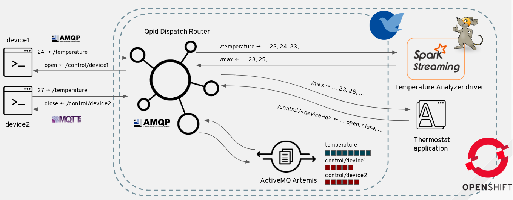
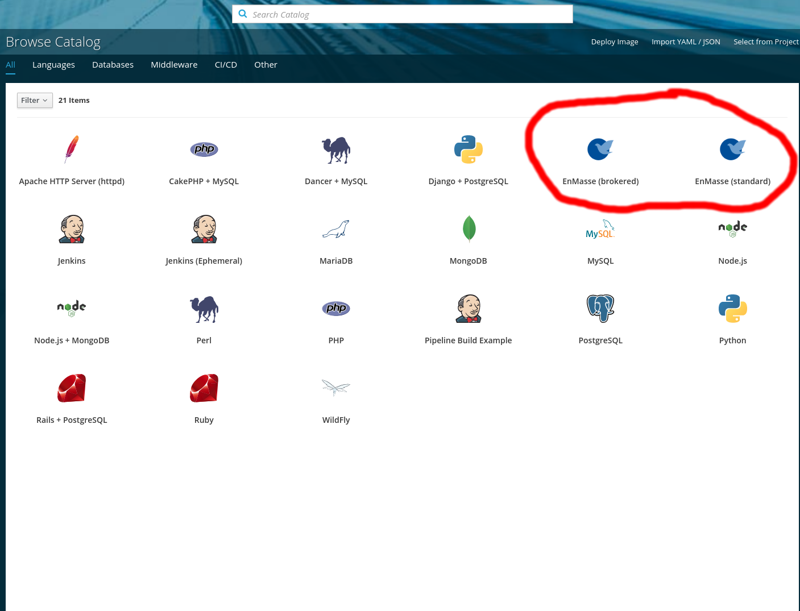
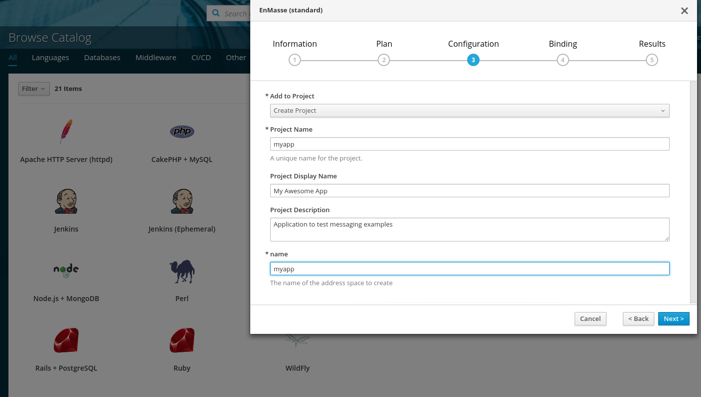
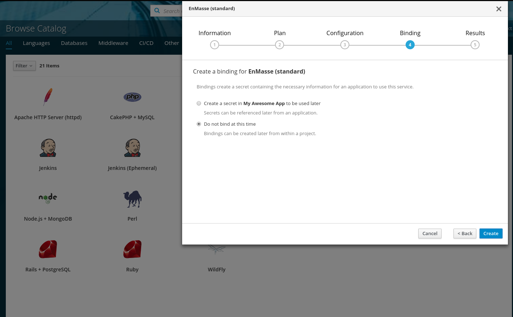
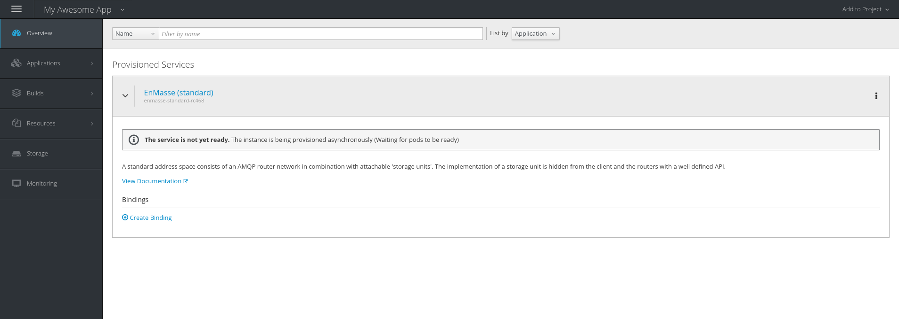
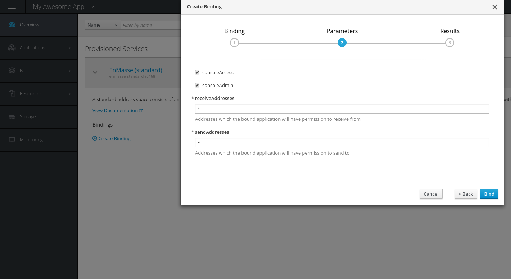
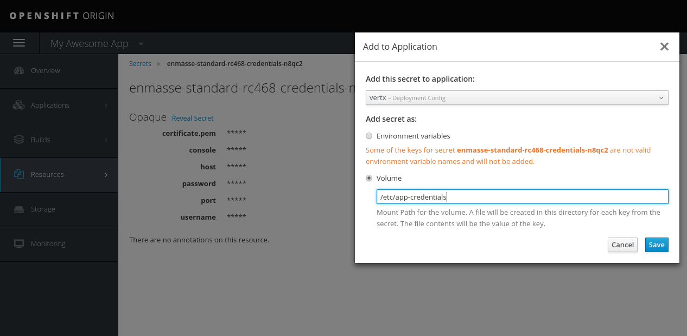

# EnMasse Workshop
In this workshop you will deploy [EnMasse](http://enmasse.io/), [Apache Spark](https://spark.apache.org/) and an IoT sensors simulator.
You gain insight into deploying and operating an EnMasse cluster, and connect it to a Spark cluster for analyzing the sensors data.

## Prerequisites

This tutorial can be run from scratch where you install OpenShift, EnMasse and Spark. You
might also have an environment setup for you with these components, in which case you can skip the
parts marked optional. When installing from scratch, tutorial requires [Ansible](www.ansible.org) to deploy components to OpenShift.

To build the java code, you need [Maven](https://maven.apache.org/) already installed on the machine.  If you don't have that, there is the [official installation guide](https://maven.apache.org/install.html) for doing that. Finally, the [OpenShift](https://www.openshift.org) client tools is used for several operations.

## Overview

In this workshop we will be working with 5 different components:

* An EnMasse messaging service
* A Spark cluster for doing analytics
* A Spark driver containing the analytics code
* A Thermostat application performing command & control of devices
* One or more IoT device simulators

The first 2 will be deployed directly to OpenShift and may be already setup for you. The spark-driver and thermostat will be built and
deployed to OpenShift from your laptop, and the device IoT simulator will be running locally on your laptop.



## (Optional) Installing OpenShift

### Downloading and installing minishift

If you don't have an OpenShift cluster available, you can use [minishift](https://github.com/minishift/minishift/) to run OpenShift locally on your laptop. Minishift supports all major OS platforms.  Go to https://github.com/minishift/minishift/releases and select the latest version and the download for your OS.

### Starting minishift

For this workshop, you need at least 4GB of RAM for your minishift instance since we're running both EnMasse and
Spark on a local OpenShift cluster.

```
minishift start --cpus 2 --memory 4096
```

Once this command completes, the OpenShift cluster should be ready to use.

### Exploring the console

Take a few minutes to familiarize yourself with the OpenShift console. If you use minishift, you can run `minishift dashboard` which will open a window in your web browser. With minishift, you can login with username <b>developer</b> and password <b>developer</b>.

### Getting OC tools

In order to execute commands against the OpenShift cluster, an `oc` client tool is needed.
Go to [OpenShift Origin client tools releases](https://github.com/openshift/origin/releases/) and download
the latest stable release (3.7.2 as of time of writing). Unpack the release:

```
tar xvf openshift-origin-client-tools-v3.7.2-282e43f-linux-64bit.tar.gz
```

Then add the folder with the `oc` tools to the `PATH` :

```
PATH=$PATH:openshift-origin-client-tools-v3.7.2-282e43f-linux-64bit.tar.gz
```

## (Optional) Installing EnMasse

EnMasse is an open source messaging platform, with focus on scalability and performance. EnMasse can run on your own infrastructure or in the cloud, and simplifies the deployment of messaging infrastructure.

For this workshop, all messages will flow through EnMasse in some way.

The EnMasse version used in this workshop can be found in the `enmasse` directory. We will use an [Ansible](www.ansible.org) playbook to install EnMasse and have a look at its options.

### Running the playbook

This workshop will use the following [playbook](enmasse/ansible/playbooks/openshift/workshop.yml):

```
- hosts: localhost
  vars:
    namespace: enmasse-workshop
    multitenant: true
    enable_rbac: true
    service_catalog: true
    keycloak_admin_password: admin
    authentication_services:
      - standard
  roles:
    - enmasse
```

This playbook instructs ansible to install EnMasse to the `enmasse-workshop` namespace in OpenShift.  We will use the service catalog integration to make it easy to provision the messaging service. We will also use ([keycloak](www.keycloak.org)) for authentication. If your OpenShift cluster is on a public network, please change the `keycloak_admin_password` to what you prefer.

You can modify the settings to your liking, but the rest of the workshop will assume the above being set.

To install EnMasse, first log in to your OpenShift cluster, then run the playbook:

```
oc login -u developer -p developer https://localhost:8443 
ansible-playbook enmasse/ansible/playbooks/openshift/workshop.yml
```

### Startup

You can observe the state of the EnMasse cluster using `oc get pods -n enmasse-workshop`. When all the pods are in the `Running` state, the cluster is ready. While waiting, go to the OpenShift console.

In the OpenShift console, you can see the different deployments for the various EnMasse components. You can go into each pod and look at the logs. If we go to the address controller log, you can see that its creating a 'default' address space.

## (Optional) Installing Apache Spark

An official support for Apache Spark on OpenShift is provided by the [radanalytics.io](https://radanalytics.io/) project by means of
the Oshinko application with a Web UI for deploying a Spark cluster. Other than using such a Web UI, a CLI tool is available as well which is used for this workshop.

Go to [Oshinko CLI downloads](https://github.com/radanalyticsio/oshinko-cli/releases) and download
the latest release (0.3.1 as of time of writing). Unpack the release:

```
tar xvf oshinko_v0.3.1_linux_amd64.tar.gz
```

Then use the following command in order to deploy a Spark cluster made by one master node and one slave node.

```
export SPARK_NAME=<something>

oc new-project spark
./oshinko_linux_amd64/oshinko create $SPARK_NAME --masters=1 --workers=1
```

## IoT Application

Now that the cluster has been set up, its time to work on the example application. First, we will
provision messaging infrastructure to use with the application.

### Provisioning messaging

Go to the OpenShift Console.

In the OpenShift Service Catalog overview, select either of "EnMasse (standard)" or "EnMasse (brokered)".



Select among the available plans. Select the "Create Project" in the drop-down box.

Use the same value for the "name" field. The address space will be provisioned and may take a few
minutes.



Skip binding at this point, we will perform the bind later.



If you go to your project, you should see the service provisioning in progress.



Once the provisioning is complete, we can login to the console and create the addresses we need for
the workshop.

### Creating messaging addresses

In EnMasse, you have the concepts of address spaces and addresses.

An address space is a group of addresses that can be accessed through a single connection (per
protocol). This means that clients connected to the endpoints of an address space can send messages
to or receive messages from any address it is authorized to send messages to or receive messages
from within that address space. An address space can support multiple protocols, which is defined by
the address space type.

Each messaging service provisioned in the service catalog creates a new address space. Conceptually,
an address space may share messaging infrastructure with other address spaces.

An address is part of an address space and represents a destination used for sending and receiving
messages. An address has a type, which defines the semantics of sending messages to and receiving
messages from that address. An address also has a plan, which determines the amount of resources
provisioned to support the address.

In the 'standard' address space, we have 4 types of addresses.

   * **multicast** : 'direct' one-to-many
   * **anycast** : 'direct' peer-2-peer
   * **queue** : queue
   * **topic** : pub/sub

### Creating addresses for this workshop

Login to the messaging console URL given by the provisioned service. You should be redirected to the
authentication service. On the side of the login form, you can see a button named "OpenShift".
Click on that to authenticate your user using your OpenShift credentials.

Once logged in, create the following addresses:

   * _temperature_ : type topic - used by devices to report temperature
   * _max_ : type anycast - used by Spark driver to report the max temperature
   * _control/deviceX_ : type topic - used to send control messages to devices. Per-device control messages will be sent to control/$device-id

### Authentication and Authorization

In this workshop we aim to setup a secure-by-default IoT solution, so we need to define the 
applications and what addresses they need to access. Before we create the bindings we need, lets
define the mapping:

* deviceX - send: temperature, recv: control/deviceX
* spark-driver - recv: temperature, send: max
* thermostat - recv: max, send: control*

We will create the bindings to each of the application as we deploy them.

### Deploying the "Temperature Analyzer" Spark driver

The `spark-driver` directory provides the Spark Streaming driver application and a Docker image for running the related Spark driver inside the cluster. The spark-driver is deployed by building and running it on the OpenShift cluster.  The spark-driver uses the [fabric8-maven-plugin](https://github.com/fabric8io/fabric8-maven-plugin) to create a docker image, an OpenShift deployment config, and deploy the spark-driver into OpenShift.

To deploy the spark driver:

```
mvn clean package fabric8:resource fabric8:build fabric8:deploy -Dspark.master.host=myspark.spark.svc -Dspark.app=myapp
```

This command will package the application and build a Docker image deployed to OpenShift.

Once the driver has been deployed, we need to create a binding with the permissions we defined above. Click on "Create binding" to open the dialog to create a binding. Set `sendAddresses` to `max` and `recvAddresses` to `temperature`.



Go to the secret that was created and click "Add to application". This will allow you modify your application deployment to mount the secret so that the example application can use it. Select the option to mount it and enter `/etc/app-credentials` as the mount point.




The spark-driver will now redeploy and read the credentials from the binding.

### Deploying the "Thermostat" application

The thermostat application uses the [fabric8-maven-plugin](https://github.com/fabric8io/fabric8-maven-plugin) to create a docker image, an OpenShift deployment config, and deploy the thermostat into OpenShift.

To build the application and a docker image:

```
cd iot/thermostat
mvn -Dfabric8.mode=openshift package fabric8:build
```

To deploy the image to the OpenShift cluster

```
mvn fabric8:resource fabric8:deploy
```

The thermostat will be deployed to the OpenShift cluster. The pod will be named `thermostat-$number` where `$number` is incremented each time you run the deploy command.

Once the thermostat has been deployed, we need to create a binding with the permissions we defined above. Click on "Create binding" to open the dialog to create a binding. Set `sendAddresses` to `control*` and `recvAddresses` to `max`.


Go to the secret that was created and click "Add to application". This will allow you modify your application deployment to mount the secret so that the example application can use it. Select the option to mount it and enter `/etc/app-credentials` as the mount point.


The thermostat will now redeploy and read the credentials from the binding.

### Running the IoT simulated devices

Heating simulated devices are provided for simulating data sent to the IoT system and receiving messages.
The devices supports two protocols, AMQP and MQTT, which are configurable.
The Heating device application :

* get temperature values from a simulated DHT22 temperature sensor sending them to the _temperature_ address periodically
* receive commands for opening/closing a simulated valve on the _control/$device-id_ address

The console application can be configured using a `device.properties` file which provides following parameters :

* _service.hostname_ : hostname of the EnMasse messaging/mqtt service to connect (for AMQP or MQTT)
* _service.port_ : port of the EnMasse messaging service to connect
* _service.temperature.address_ : address on which temperature values will be sent (should not be changed from the _temperature_ value)
* _service.control.prefix_ : prefix for defining the control address for receiving command (should not be changed from the _control_ value)
* _device.id_ : device identifier
* _device.username_ : device username (from binding) for EnMasse authentication
* _device.password_ : device password (from binding) for EnMasse authentication
* _device.update.interval_ : periodic interval for sending temperature values
* _device.transport.class_ : transport class to use in terms of protocol. Possible values are _io.enmasse.iot.transport.AmqpClient_ for AMQP and _io.enmasse.iot.transport.MqttClient_ for MQTT
* _device.transport.ssl.servercert_ : server certificate file path for accessing EnMasse using a TLS connection
* _device.dht22.temperature.min_ : minimum temperature provided by the simulated DHT22 sensor
* _device.dht22.temperature.max_ : maximum temperature provided by the simulated DHT22 sensor

#### Getting TLS certificates

Connections to EnMasse running on OpenShift externally are possible only through TLS protocol. In order to have such connections working, we first need to create a binding for devices to use. Depending on your preferences, you can create a per-device binding with restrictions on addresses, or one binding for all devices. In any case, you need to enable the `externalAccess` attribute when creating the binding, so that you get the external access endpoints to use for devices.

When you view the secret for the binding, you should see an `externalMessagingHost` and `externalMqttHost` (AMQP and MQTT) with corresponding port entries. You should use these values for the `service.hostname` and `service.port` in the device configuration.

The `username` and `password` fields should go into `device.username` and `device.password` in the device config.

The `messagingCert` and `mqttCert` fields contains the certificates needed by the AMQP and MQTT clients respectively.

Save the certificates to a local file (`messagingCert.pem` and `mqttCert.pem` for instance) and change the `device.transport.ssl.servercert` field in the device configuration to point to this file.

#### Using Maven

In order to run the `HeatingDevice` application you can use the Maven `exec` plugin with the following command from the `clients` directory.

```
cd iot/clients
mvn exec:java -Dexec.mainClass=io.enmasse.iot.device.impl.HeatingDevice -Dexec.args=<path-to-device-properties-file>
```

You can run such command more times in order to start more than one devices (using different Keycloak users and device-id for them). The provided `device-amqp.properties` and `device-mqtt.properties` files can be used as starting point for AMQP and MQTT device configuration.

#### Using pre-built JARs

The provided `heating-device.jar` can be used for starting a simulated heating device with the following command.

```
cd iot/clients/jar
java -jar heating-device.jar <path-to-device-properties-file>
```

The console application needs only one argument which is the path to the `device.properties` file with the device configuration.
