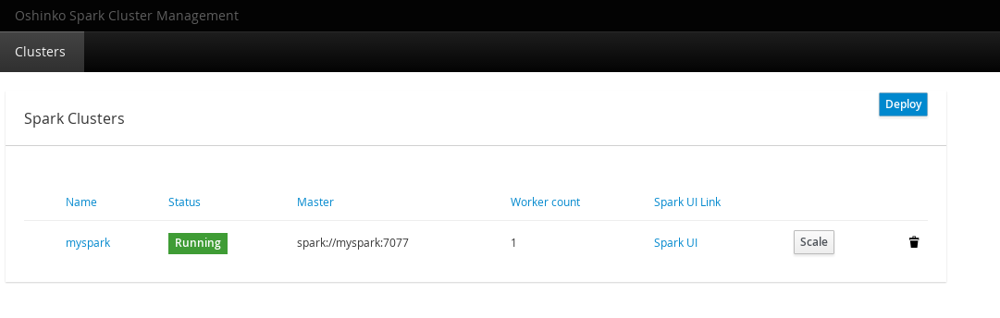

# EnMasse Workshop
In this workshop you will deploy [EnMasse](http://enmasse.io/), [Apache Spark](https://spark.apache.org/) and an IoT sensors simulator.
You gain insight into deploying and operating an EnMasse cluster, and connect it to a Spark cluster for analyzing the sensors data.

## Setting up

In this workshop we will be deploying 4 different components:

* EnMasse messaging service
* A Spark cluster for doing analytics
* A Thermostat application performing command & control of devices
* One or more IoT device simulators

The first 2 will be deployed directly to OpenShift. The thermostat will be built and
deployed to OpenShift from your laptop, and the device IoT simulator will be running locally on your laptop.


### (Optional) Installing OpenShift

#### Downloading and installing minishift

If you don't have an OpenShift cluster available, you can use [minishift](https://github.com/minishift/minishift/) to run OpenShift locally on your laptop. Minishift supports all major OS platforms.  Go to https://github.com/minishift/minishift/releases and select the latest version and the download for your OS.

#### Starting minishift

For this workshop, you need at least 4GB of RAM for your minishift instance since we're running both EnMasse and
Spark on a local OpenShift cluster.

```
minishift start --cpus 2 --memory 4096
```

Once this command completes, the OpenShift cluster should be ready to use.

### Exploring the console

Take a few minutes to familiarize yourself with the OpenShift console. If you use minishift, you can run `minishift dashboard` which will open a window in your web browser. With minishift, you can login with username <b>developer</b> and password <b>developer</b>.

## EnMasse messaging service

EnMasse is an open source messaging platform, with focus on scalability and performance. EnMasse can
run on your own infrastructure or in the cloud, and simplifies the deployment of messaging
infrastructure.

For this workshop, all messages will flow through EnMasse in some way.

### Installing EnMasse

Go to [EnMasse downloads](https://github.com/EnMasseProject/enmasse/releases/latest) and download
the latest release (0.13.0 as of time of writing). Unpack the release:

```
tar xvf enmasse-0.13.0.tgz
```

The relase bundle contains OpenShift templates as well as a deployment script for deploying EnMasse.
We will use this script in this tutorial and have a look at its options to get a better idea of how
it works.

#### Deployment script

Run the deployment script with `-h` option

```
./enmasse-0.13.0/deploy-openshift.sh -h
```

In this workshop, we will deploy using the standard (Keycloak) authentication service, use a unique id as your namespace, and tell it to deploy to the OpenShift cluster.
Set $NAMSPACE to the OpenShift project you will be using through this workshop:

```
export USER_ID=<something>
export NAMESPACE=workspace-$USER_ID
export OPENSHIFT_MASTER=<something>

./enmasse-0.13.0/deploy-openshift.sh -a standard -n $NAMESPACE -m $OPENSHIFT_MASTER -u $USER_ID
```

#### Startup

You can observe the state of the EnMasse cluster using `oc get pods -n $NAMESPACE`. When all the pods are in the `Running` state, the cluster is ready. While waiting, go to the OpenShift console.

In the OpenShift console, you can see the different deployments for the various EnMasse components. You can go into each pod and look at the logs. If we go to the address controller log, you can see that its creating a 'default' address space.

#### Authenticating

Our cluster does not yet have any users created, so it cannot create addresses. We therefore have to create a user using the Keycloak interface. By default, the Keycloak service is not exposed, so we need to expose that service.

```
oc expose service standard-authservice --name=keycloak -n $NAMESPACE --port 8080
```

Go to the OpenShift console, application -> routes, and click on the hostname for the 'keycloak' route. This should bring you to the keycloak admin console. The admin user is protected by an automatically generated password, so we need to extract that as well before being able to create users.

```
oc extract secret/keycloak-credentials -n $NAMESPACE
cat admin.username
cat admin.password
```

In the Keycloak UI, create a new user, and a set of credentials for that user. Make sure the user is
enabled, and that the credentials are not marked as temporary.

For this workshop we could use following users for example :

* _deviceX_ : as deviceX (i.e. device1, device2, ...) user
* _sparkdriver_ : as Spark driver application user
* _thermostat_ : as thermostat application user

#### Creating messaging addresses

In EnMasse, you have the concepts of address spaces and addresses.

An address space is a group of addresses that can be accessed through a single connection (per
protocol). This means that clients connected to the endpoints of an address space can send messages
to or receive messages from any address it is authorized to send messages to or receive messages
from within that address space. An address space can support multiple protocols, which is defined by
the address space type.

An address is part of an address space and represents a destination used for sending and receiving
messages. An address has a type, which defines the semantics of sending messages to and receiving
messages from that address.

In the 'standard' address space, we have 4 types of addresses.

   * **multicast** : 'direct' one-to-many using dispatch router
   * **anycast** : 'direct' peer-2-peer using dispatch router
   * **queue** : queue on broker
   * **topic** : pub/sub on broker


##### Creating addresses for this workshop

Go to the console, and locate the 'console' route. Click on the link to get to the EnMasse console.

Create an addresses for your IoT sensors to report metrics on:

   * _temperature_ : type topic - used by devices to report temperature
   * _max_ : type anycast - used by Spark driver to report the max temperature
   * _control_ : type topic - used to send control messages to devices. Per-device control messages will be sent to control/$device-id

### Installing Apache Spark

An official support for Apache Spark on OpenShift is provided by the [radanalytics.io](https://radanalytics.io/) project which provides
the Oshinko application with a web UI for deploying a Spark cluster.

First, you have to get the Oshinko resources into your project.

```
oc create -f https://radanalytics.io/resources.yaml -n $NAMESPACE
```

Then start the Oshinko Web UI application.

```
oc new-app oshinko-webui
```

Using this UI, you are able to deploy an Apache Spark cluster inside OpenShift specifying the number of worker nodes you want (other than the default master).



### Deploying the "Temperature Analyzer" Spark driver

The `spark-driver` directory provides the Spark Streaming driver application and a Docker image for running the related Spark driver inside the cluster. This application can be packaged running the following command from such directory.

```
mvn clean install package -Pbuild-docker-image
```

This command will package the application and build a Docker image ready to be deployed on OpenShift.
In order to deploy the Spark driver, an OpenShift template is available which can be instantiated with the following command:

```
oc process -f target/fabric8/spark-driver-template.yaml SPARK_MASTER_HOST=myspark SPARK_DRIVER_USERNAME=test SPARK_DRIVER_PASSWORD=test | oc create -f -
```
It's possible to configure the Spark driver changing these parameters:

* _SPARK_MASTER_HOST_ : hostname of the Spark master node
* _SPARK_MASTER_PORT_ : the port of the Spark master node (default value is 7077)
* _SPARK_DRIVER_USERNAME_ : username provided by Keycloak for driver authentication with EnMasse
* _SPARK_DRIVER_PASSWORD_ : password provided by Keycloak for driver authentication with EnMasse

### Deploying the "Thermostat" application

The thermostat application uses the [fabric8-maven-plugin](https://github.com/fabric8io/fabric8-maven-plugin) to create a docker image, an OpenShift deployment config, and deploy the thermostat into OpenShift.

First, modify the thermostat configuration in
`iot/thermostat/src/main/resources/config.properties`. Make sure that `service.hostname` matches
that of the messaging service, and that `service.username` and `service.password` matches the
credentials you created in Keycloak. You can also change the addresses used in this workshop, but it
is not needed for the thermostat to run.

To build the application and a docker image:

```
cd iot/thermostat
mvn -Dfabric8.mode=openshift package fabric8:build
```

To deploy the image to the OpenShift cluster

```
mvn fabric8:resource fabric8:deploy
```

The thermostat will be deployed to the OpenShift cluster. The pod will be named `thermostat-$number` where `$number` is incremented each time you run the deploy command.

### Running the IoT simulated devices

Heating simulated devices are provided for simulating data sent to the IoT system and receiving messages.
The devices supports two protocols, AMQP and MQTT, which are configurable.
The Heating device application :

* get temperature values from a simulated DHT22 temperature sensor sending them to the _temperature_ address periodically
* receive commands for opening/closing a simulated valve on the _control/$device-id_ address

The console application can be configured using a `device.properties` file which provides following parameters :

* _service.hostname_ : hostname of the EnMasse messaging/mqtt service to connect (for AMQP or MQTT)
* _service.port_ : port of the EnMasse messaging service to connect
* _service.temperature.address_ : address on which temperature values will be sent (should not be changed from the _temperature_ value)
* _service.control.prefix_ : prefix for defining the control address for receiving command (should not be changed from the _control_ value)
* _device.id_ : device identifier
* _device.username_ : device username (from Keyclock) for EnMasse authentication
* _device.password_ : device password (from Keyclock) for EnMasse authentication
* _device.update.interval_ : periodic interval for sending temperature values
* _device.transport.class_ : transport class to use in terms of protocol. Possible values are _io.enmasse.iot.transport.AmqpClient_ for AMQP and _io.enmasse.iot.transport.MqttClient_ for MQTT
* _device.transport.ssl.servercert_ : server certificate file path for accessing EnMasse using a TLS connection
* _device.dht22.temperature.min_ : minimum temperature provided by the simulated DHT22 sensor
* _device.dht22.temperature.max_ : maximum temperature provided by the simulated DHT22 sensor

#### Getting TLS certificates

Connections to EnMasse running on OpenShift are possible only thrugh TLS protocol.
In order to have such connections working, we need to get the server certificate that the device has to use for establishing the TLS connection.
Because devices can connect using AMQP or MQTT we need to extract two different server certificates for that.
First of all, let's create two different directories for storing the certificates :

```
mkdir amqp-certs
mkdir mqtt-certs
```

For AMQP based devices, the command is the following :

```
oc extract secret/external-certs-messaging --to=amqp-certs -n $NAMESPACE
```

In the same way, for MQTT based devices, the command is the following :

```
oc extract secret/external-certs-mqtt --to=mqtt-certs -n $NAMESPACE
```

Both commands extract the certificate `server-cert.pem` file. The file path needs to be set as value for the device configuration property _device.transport.ssl.servercert_.

#### Using Maven

In order to run the `HeatingDevice` application you can use the Maven `exec` plugin with the following command from the `clients` directory.

```
mvn exec:java -Dexec.mainClass=io.enmasse.iot.device.impl.HeatingDevice -Dexec.args=<path-to-device-properties-file>
```

#### Using pre-built JARs

The provided `heating-device.jar` can be used for starting a simulated heating device with the following command.

```
java -jar heating-device.jar <path-to-device-properties-file>
```

The console application needs only one argument which is the path to the `device.properties` file which contains the device configuration.
