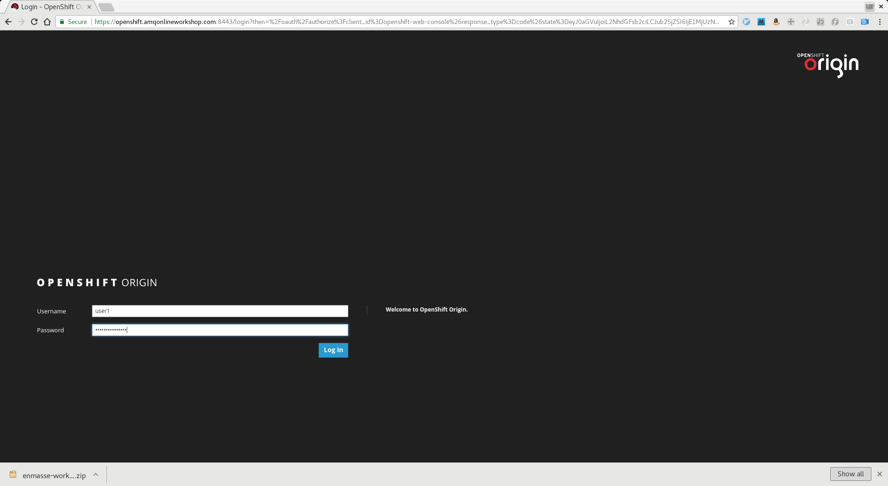
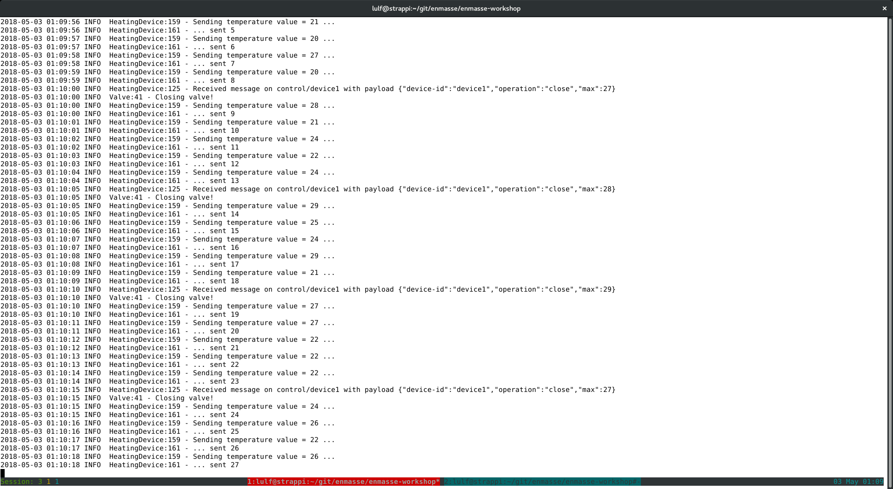
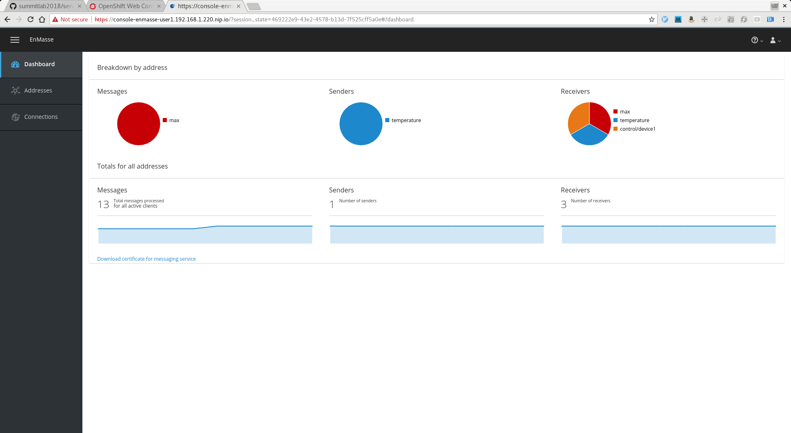

# EnMasse Workshop

In this workshop you will deploy messaging based on [EnMasse](http://enmasse.io/), [Apache Spark](https://spark.apache.org/) and an IoT sensors simulator. You will learn how to provision messaging infrastructure to connect all components in an end 2 end IoT application.

## Prerequisites

*NOTE* An OpenShift cluster with EnMasse has been set up at [https://openshift.amqonlineworkshop.com:8443/](https://openshift.amqonlineworkshop.com:8443/). Login credentials will be handed out by the presenters.

To build the java code, you need [Maven](https://maven.apache.org/) already installed on the machine.  If you don't have that, there is the [official installation guide](https://maven.apache.org/install.html) for doing that. Finally, the [OpenShift](https://github.com/openshift/origin/releases/tag/v3.9.0) client tools is used for several operations. Follow [this guide](https://github.com/EnMasseProject/enmasse-workshop#getting-oc-tools) on how to install it if you don't have it installed yet.

Finally, internet connection is needed!

## Overview

In this workshop we will be working with 5 different components:

* An EnMasse messaging service
* A Spark application containing the analytics code
* A Thermostat application performing command & control of devices
* One or more IoT device simulators

The messaging service has already been setup on the OpenShift cluster. The spark and thermostat applications will be built and
deployed to OpenShift from your laptop, and the device IoT simulator will be running locally on your laptop.


## Downloading the tutorial files

The easiest way to use this tutorial is to [download](https://github.com/EnMasseProject/enmasse-workshop/archive/rhsummit18.zip) the zip and and unzip the archive on your laptop.

## IoT Application

The main part of this workshop is to setup an end-2-end IoT application.

1. Login to the OpenShift console:

    

1. Create a workspace for your project:

    
    

This project will be used to deploy the IoT application.

### Provisioning messaging

We now provision messaging infrastructure to use with the application.

1. In the OpenShift Service Catalog overview, select the "EnMasse (standard)" service:

    

1. Select the 'unlimited-standard' plan:

    

1. Select the project previously created and enter a name for the address space:

    

1. Skip creating the binding:

    

1. The address space will be provisioned and may take a few minutes. Jump to the project page:

    

Once the provisioning is complete you should be able to see the dashboard link which we will later use to access the messaging console and create the addresses we need for the workshop.


But first, and introduction to some EnMasse concepts.

### Address spaces and addresses

In EnMasse, you have the concepts of address spaces and addresses. When you provision a messaging
service like above, you effectively create an address space.

An address space is a group of addresses that can be accessed through a single connection (per
protocol). This means that clients connected to the endpoints of an address space can send messages
to or receive messages from any address it is authorized to send messages to or receive messages
from within that address space. An address space can support multiple protocols, which is defined by
the address space type.

Each messaging service provisioned in the service catalog creates a new address space. Conceptually,
an address space may share messaging infrastructure with other address spaces.

An address is part of an address space and represents a destination used for sending and receiving
messages. An address has a type, which defines the semantics of sending messages to and receiving
messages from that address. An address also has a plan, which determines the amount of resources
provisioned to support the address.

In the 'standard' address space, we have 4 types of addresses.

   * **multicast** : 'direct' one-to-many
   * **anycast** : 'direct' peer-2-peer
   * **queue** : queue
   * **topic** : pub/sub

### Creating addresses for this workshop

1. Click on the dashboard link to get to the messaging console:

    

    You will be redirected to a login screen.

1. Click the 'OpenShift' button to login with your OpenShift credentials:

    

1. On the side of the login form, you can see a button named "OpenShift". Click on that to authenticate your user using your OpenShift credentials:

    

1. Allow keycloak to read user info:

    

1. Once logged in, click on the "Addresses" link and click "create" to create addresses:

    

1. Create the `temperature` address with type topic. This address is used by devices to report their temperature:

    

1. Select the `sharded-topic` plan (*NOTE* this is required for MQTT to work. You can choose `pooled-topic` if using AMQP only):

    

1. Create the `max` address with type anycast. This address is used by the spark app to send messages to the thermostat app:

    

1. Select the `standard` plan:

    

1. Create the per-device addresses. I.e. `control/device1`. This is used by the thermostat app to send control messages to the device:

    

1. Select the `sharded-topic` plan (*NOTE* this is required for MQTT to work. You can choose `pooled-topic` if using AMQP only):

    

Once the addresses have been created, they should all be marked ready by the green 'tick' in the address overview:


### Authentication and Authorization

In this workshop we aim to setup a secure-by-default IoT solution, so we need to define the 
applications and what addresses they need to access. Before we create the bindings we need, lets
define the mapping of what addresses each component needs to access:

* _deviceX_ :
  * recv: control/deviceX
  * send: temperature
* _spark_ : 
  * recv: temperature
  * send: max
* _thermostat_ :
  * recv: max
  * send: control\*

We will create the bindings to each of the applications as we deploy them.

### Deploying the "Temperature Analyzer" Spark application

The spark application is composed of 2 parts:

* Apache Spark cluster
* Apache Spark driver

#### Deploying a Spark Cluster

1. Login to the cluster using the command line:

    ```
    oc login https://openshift.amqonlineworkshop.com:8443 -u <user>
    oc project <user>
    ```

1. Deploy the cluster using the [template](https://github.com/EnMasseProject/enmasse-workshop/blob/master/spark/cluster-template.yaml) provided in this tutorial:

    ```
    cd enmasse-workshop-rhsummit18/spark
    oc process -f cluster-template.yaml MASTER_NAME=spark-master | oc create -f -
    ```

    This will deploy the spark cluster which may take a while. In your project overview you should see
    the deployments:

    

#### Deploying the Spark driver

The `iot/spark-driver` directory provides the Spark Streaming driver application and a Docker image for running the related Spark driver inside the cluster. The spark-driver is deployed by building and running it on the OpenShift cluster.  The spark-driver uses the [fabric8-maven-plugin](https://github.com/fabric8io/fabric8-maven-plugin) to create a docker image, an OpenShift deployment config, and deploy the spark-driver into OpenShift.

1. Build the spark driver:

    ```
    cd enmasse-workshop-rhsummit18/iot/spark-driver
    mvn clean package fabric8:resource fabric8:build fabric8:deploy -Dspark.master.host=spark-master.<user>.svc
    ```

    This command will package the application and build a Docker image deployed to OpenShift. You can watch the status by looking at the build:

    

    Once the driver has been deployed, you should see it in the project overview:

    

1. We now need to create a binding with the permissions we defined above. Click on "Create binding" to open the dialog to create a binding:

    

1. Set `sendAddresses` to `max` and `recvAddresses` to `temperature`:

    

1. The binding should get created successfully, close the dialog:

    

1. Go to the secret that was created:

    

1. Click "Add to application":

    

    This will allow you modify your application deployment to mount the secret so that the example application can use it. 

1. Select the `spark-driver` as application and the option to mount the secret and enter `/etc/app-credentials` as the mount point:

    

The spark-driver will now redeploy and read the credentials from the binding.


### Deploying the "Thermostat" application

The thermostat application uses the [fabric8-maven-plugin](https://github.com/fabric8io/fabric8-maven-plugin) to create a docker image, an OpenShift deployment config, and deploy the thermostat into OpenShift.

1. Build the application as a Docker image and deploy it to the OpenShift cluster:

    ```
    cd enmasse-workshop-rhsummit18/iot/thermostat
    mvn package fabric8:resource fabric8:build fabric8:deploy -Dfabric8.mode=openshift
    ```
    You can see the builds by going to the builds menu again:

    

    Eventually, the thermostat is deployed:

    

    Once the thermostat has been deployed, we need to create a binding with the permissions we defined above. 

1. Click on "Create binding" to open the dialog to create a binding:

    

1. Set `sendAddresses` to `control*` and `recvAddresses` to `max`:

    

1. Go to the secret that was created:

    

1. Click "Add to application":

    

    This will allow you modify your application deployment to mount the secret so that the example application can use it.

1. Select the `thermostat` as application and the option to mount the secret and enter `/etc/app-credentials` as the mount point:

    

The thermostat will now redeploy and read the credentials from the binding:


### Running the IoT simulated devices

Heating simulated devices are provided for simulating data sent to the IoT system and receiving messages.
The devices supports two protocols, AMQP and MQTT, which are configurable.
The Heating device application :

* get temperature values from a simulated DHT22 temperature sensor sending them to the _temperature_ address periodically
* receive commands for opening/closing a simulated valve on the _control/$device-id_ address

The console application can be configured using a `device.properties` file which provides following parameters :

* _service.hostname_ : hostname of the EnMasse messaging/mqtt service to connect (for AMQP or MQTT)
* _service.port_ : port of the EnMasse messaging service to connect
* _service.temperature.address_ : address on which temperature values will be sent (should not be changed from the _temperature_ value)
* _service.control.prefix_ : prefix for defining the control address for receiving command (should not be changed from the _control_ value)
* _device.id_ : device identifier
* _device.username_ : device username (from binding) for EnMasse authentication
* _device.password_ : device password (from binding) for EnMasse authentication
* _device.update.interval_ : periodic interval for sending temperature values
* _device.transport.class_ : transport class to use in terms of protocol. Possible values are _io.enmasse.iot.transport.AmqpClient_ for AMQP and _io.enmasse.iot.transport.MqttClient_ for MQTT
* _device.transport.ssl.servercert_ : server certificate file path for accessing EnMasse using a TLS connection
* _device.dht22.temperature.min_ : minimum temperature provided by the simulated DHT22 sensor
* _device.dht22.temperature.max_ : maximum temperature provided by the simulated DHT22 sensor

#### Configuring device

1. Create another binding for the device:

    

1. This time, we want the device to read control messages for its address. We also want it to be able
to send to the temperature address. Most importantly, we want to get hold of the external hostnames
that the device can connect to.

    *NOTE* However, use '\*' and '\*' for both `sendAddresses` and `recvAddresses`, as there is a known limitation around authorization and MQTT in EnMasse.

    Make sure 'externalAccess' is set:

    

1. Once created, view the device secret:

    

1. Reveal the secret:

    

1. Copy the values for the `externalMessagingHost` and `externalMessagingPort` and configure the `service.hostname` and `service.port` fields in `iot/clients/src/main/resources/device-amqp.properties`. For MQTT, use the values `externalMqttHost` and `externalMqttPort` and write them to `iot/clients/src/main/resources/device-mqtt.properties` instead.

    Store the value of the `messagingCert.pem` field in a local file and update the `device.transport.ssl.servercert` field in `iot/clients/src/main/resources/device-amqp.properties`.  The `messagingCert` and `mqttCert` fields contains the certificates needed by the AMQP and MQTT clients respectively.

    

1. Finally, copy the values for the `username` and `password` into `device.username` and
`device.password` in the device properties file:

    

An example final configuration:

```
# service related configuration
service.hostname=messaging-enmasse-user1.192.168.1.220.nip.io
service.port=443
service.temperature.address=temperature
service.control.prefix=control
# device specific configuration
device.id=device1
device.username=user-8fc43b14-98ab-4f70-940b-2fcbb681bdf7
device.password=qpNWm/zEc+H5V5oadG9jh7WwkySZXRTOEDy/MtgqrlQ=
device.update.interval=1000
device.transport.class=io.enmasse.iot.transport.AmqpClient
device.transport.ssl.servercert=messagingCert.pem
# device sensors specific configuration
device.dht22.temperature.min=20
device.dht22.temperature.max=30
```

#### Run device using pre-built JARs

The provided `heating-device.jar` can be used for starting a simulated heating device with the following command for AMQP (replace with device-mqtt.properties for MQTT):

```
java -jar iot/clients/jar/heating-device.jar iot/clients/src/main/resources/device-amqp.properties
```

The console application needs only one argument which is the path to the `device.properties` file with the device configuration.

Example output:



If you go to your messaging console, you should see the different clients connected sending messages:



#### Run device using Maven

In order to run the `HeatingDevice` application you can use the Maven `exec` plugin with the following command from the `clients` directory.

```
cd enmasse-workshop-rhsummit18/iot/clients
mvn package
mvn exec:java -Dexec.mainClass=io.enmasse.iot.device.impl.HeatingDevice -Dexec.args=<path-to-device-properties-file>
```

You can run such command more times in order to start more than one devices (using different Keycloak users and device-id for them). The provided `device-amqp.properties` and `device-mqtt.properties` files can be used as starting point for AMQP and MQTT device configuration.

